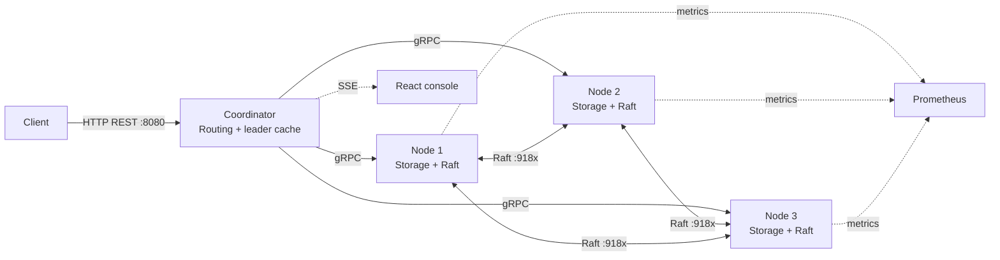
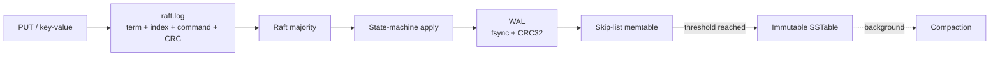

# FeatureGrid KV

### Distributed storage foundations for data science and AI infrastructure

[](https://openjdk.org/projects/jdk/21/)
[](https://spring.io/projects/spring-boot)
[](https://grpc.io)
[](https://raft.github.io/)
[](https://docs.docker.com/compose/)
[](https://vitejs.dev/)

FeatureGrid KV is a learning-focused distributed database implemented from first principles in Java. It combines a durable LSM storage engine, consistent-hash routing, Raft replication, gRPC services, and a live operations console in one inspectable project.

The goal is not to hide the machinery behind a dependency. The goal is to make the machinery readable, testable, and observable.

---

## Relevance to Data Science and AI

FeatureGrid KV explores the storage and serving foundations behind data-intensive ML systems: durable key-value access, replication, routing, caching, and operational visibility. Its REST API can hold serialized feature values, prediction results, or experiment metadata supplied by a client.

This project implements a general-purpose key-value database. Feature pipelines, model training, vector search, and feature-store semantics such as point-in-time joins are outside the current implementation.

## What It Does

| Area | Current capability |
| --- | --- |
| Client API | REST endpoints for PUT, GET, and DELETE |
| Storage | WAL, skip-list memtable, SSTables, Bloom filters, sparse indexes |
| Durability | CRC-protected WAL replay and durable Raft log recovery |
| Consensus | Custom Raft election, heartbeats, log replication, and quorum commit |
| Routing | MD5 consistent-hash ring with 150 virtual nodes per physical node |
| Transport | REST at the edge; Protocol Buffers and gRPC inside the cluster |
| Operations | Prometheus metrics, Grafana dashboards, and an SSE event stream |
| Console | React/Vite dashboard for topology, traffic, storage, and fault simulation |

### Consistency boundary

Writes are accepted by the current Raft leader and complete only after a majority quorum commits the operation. A three-node cluster therefore needs two healthy participants for writes. Reads currently use the coordinator's deterministic route and are not yet configurable by consistency level.

---

## System Shape



### One write, end to end

```text
Client
  -> Coordinator REST API
  -> consistent-hash route and cached Raft leader
  -> leader KvService over gRPC
  -> Raft log append and durable local write
  -> AppendEntries to followers
  -> majority commit
  -> state-machine apply
  -> WAL / memtable / eventual SSTable flush
  -> response to client
```

The coordinator does not own data. Each node owns its local storage engine and participates in the consensus layer.

---

## Durable Storage

### LSM write path



The storage engine and consensus log have separate responsibilities:

- `raft.log` preserves the ordered replicated command history for restart and follower catch-up.
- `raft.state` preserves the current term, vote, commit index, and last-applied index.
- The WAL protects storage-engine writes and supports crash replay.
- SSTables make flushed data immutable and searchable.
- Compaction merges files and removes obsolete versions and tombstones when safe.

### Read path

```text
GET key
  -> LRU cache
  -> current memtable
  -> newest SSTables first
  -> key-range check
  -> Bloom filter
  -> sparse index
  -> data block scan
  -> value, tombstone, or not found
```

---

## Raft Layer

Every storage node runs `RaftNode`, while `GrpcRaftTransport` supplies the network implementation. The state machine remains transport-agnostic so election and replication behavior can be tested without starting Docker or gRPC.

Implemented behavior:

- randomized election timeout between 150 and 300 ms
- leader heartbeats every 50 ms
- RequestVote term and log freshness checks
- AppendEntries consistency checks and conflict reconciliation
- majority commit for current-term entries
- `NOT_LEADER` responses for redirected writes
- durable `currentTerm` and `votedFor`
- durable Raft log records with CRC validation
- recovery that discards an incomplete final log record after a crash
- commit/application progress restored from `raft.state`

The current deployment uses one three-node Raft group. Shard-local Raft groups are a planned scale-out step, not a claim about the current topology.

---

## Live Operations Console

The React console in [`ui/`](ui/) is designed as an instrument panel for the cluster rather than a separate marketing frontend.

It includes:

- cluster statistics and latency signals
- live node cards with role and storage state
- a visual consistent-hash ring
- streamed operation and lifecycle events
- storage-engine inspection
- burst-write distribution tests
- an animated write path
- interactive PUT, GET, and DELETE controls
- coordinator-level node isolation and reconnection controls

Prometheus metrics are exposed through Spring Actuator. Grafana is provisioned from the repository configuration.

---

## Start It

### Requirements

- Java JDK 21 or newer
- Docker Desktop with Compose
- Node.js 18 or newer for the console
- `curl` for API checks
- `grpcurl` is optional for direct gRPC inspection

### Recommended: Docker Compose

```bash
# From your local project checkout
cd featuregrid-kv

docker compose up --build -d
```

Wait for the three nodes to become healthy, then use:

| Service | Address |
| --- | --- |
| Coordinator REST API | http://localhost:8080 |
| Node 1 actuator | http://localhost:8081 |
| Node 2 actuator | http://localhost:8082 |
| Node 3 actuator | http://localhost:8083 |
| Prometheus | http://localhost:9090 |
| Grafana | http://localhost:3000 |

Start the console separately:

```bash
cd ui
npm install
npm run dev
```

Open http://localhost:5173.

### Build and test locally

```bash
./gradlew build
./gradlew test
./gradlew :raft:test
```

On Windows, use `gradlew.bat` instead of `./gradlew`.

---

## Try the API

```bash
# Store a value. ttlMs is optional; zero means no expiry.
curl -X PUT http://localhost:8080/api/v1/kv/user:1 \
  -H "Content-Type: application/json" \
  -d '{"value":"Ada Lovelace","ttlMs":0}'

# Read it back.
curl http://localhost:8080/api/v1/kv/user:1

# Delete it.
curl -X DELETE http://localhost:8080/api/v1/kv/user:1

# Inspect cluster state and the ring.
curl http://localhost:8080/api/v1/monitor/state
curl http://localhost:8080/api/v1/monitor/ring

# Follow live events.
curl -N http://localhost:8080/api/v1/monitor/events
```

The monitoring `kill` action blacklists a node at the coordinator. It does not terminate the process or stop Raft. For a real crash simulation, stop a container:

```bash
docker stop kv-node-2
docker start kv-node-2
```

---

## Configuration

| Variable | Example | Purpose |
| --- | --- | --- |
| `NODE_ID` | `node-1` | Unique node identity |
| `HTTP_PORT` | `8081` | Actuator and storage HTTP port |
| `GRPC_PORT` | `9091` | Client-facing KV gRPC port |
| `RAFT_PORT` | `9181` | Dedicated Raft gRPC port |
| `RAFT_PEERS` | `node-2=host:9182,...` | Other Raft members |
| `DATA_DIR` | `./data/node-1` | WAL, SSTables, `raft.log`, and `raft.state` |
| `MEMTABLE_MAX_MB` | `8` | Memtable flush threshold |

Persistent node data should live on a Docker volume or another disk that survives container replacement.

---

## Repository Map

```text
featuregrid-kv/
├── proto/                 Protobuf contracts for KV and Raft RPCs
├── storage-engine/        WAL, memtable, SSTables, cache, TTL, compaction
├── raft/                  Raft state machine, durable log, transport, tests
├── node/                  Storage-node Spring Boot application and gRPC API
├── coordinator/           REST edge, routing, leader retry, monitoring
├── client/                Client-side module and shared build integration
├── ui/                    React/Vite operations console
├── config/                Prometheus and Grafana provisioning
├── docker-compose.yml     Three-node local cluster and observability stack
└── docs/                  Architecture notes and design context
```

---

## Roadmap Without Changing the Shape

These improvements fit the existing modules and can be delivered incrementally:

### Reliability

- Persist and replay the complete Raft commit history during node recovery.
- Add snapshotting and log compaction so `raft.log` cannot grow forever.
- Add restart, leader-loss, quorum-loss, and network-partition integration tests.
- Make `raft.state` updates atomic and fsync-backed, matching the Raft log guarantees.

### Storage

- Persist absolute TTL expiration timestamps in WAL and SSTable records.
- Add a manifest file for SSTable discovery and safer crash recovery.
- Add configurable cache size, compaction thresholds, and Bloom-filter parameters.
- Add checksums and version metadata to every SSTable block.

### Routing and scale

- Add configurable replication factor instead of treating the whole cluster as one replica group.
- Introduce shard-local Raft groups while keeping the coordinator and node APIs stable.
- Add controlled node join, leave, and key-range migration.
- Replace the static node list with membership and health information from the cluster.

### API and security

- Add request size limits, key validation, rate limiting, and structured error responses.
- Add read consistency options such as `ONE`, `QUORUM`, and `ALL`.
- Add idempotency-key handling for retried client writes.
- Enable TLS and authentication for REST and gRPC deployments outside local development.

### Developer experience

- Add a repeatable fault-injection test profile.
- Add a benchmark module for write throughput, read latency, recovery time, and compaction cost.
- Add OpenAPI documentation for the REST API.
- Replace the starter UI documentation with screenshots, workflows, and a dashboard guide.

---

## Design Principles

1. **Durability before acknowledgement.** A successful write should have a clear recovery story.
2. **Consensus before visibility.** Replicated commands become visible through the committed state-machine path.
3. **Small replaceable boundaries.** Storage, consensus, transport, routing, and presentation remain separate modules.
4. **Observability is part of the feature.** The dashboard and metrics expose behavior that would otherwise be invisible.
5. **Correctness before scale.** The current three-node design is a dependable base for introducing sharding later.

---

## License

MIT. See [LICENSE](LICENSE).

---

Built as a hands-on study of storage engines, replication, failure recovery, and the small decisions that make distributed systems behave.
